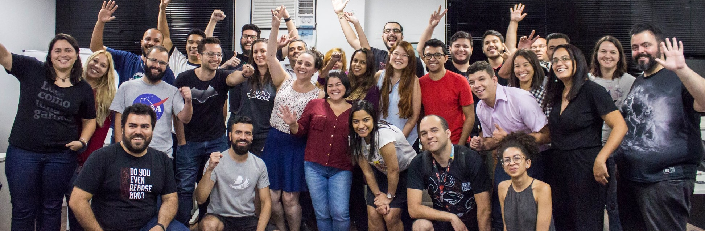

  

    

      
      
      

        <a href="/events" id="download-button" class="btn-large waves-effect waves-light teal lighten-1">
          Próximo evento: {{ event_date.first }} de {{ site.events.first[0] }} de {{ event_date.last }}
        </a>
      

    

  

  

  <!-- ABOUT -->
  

    
<h3><strong>sobre</strong></h3>

  

  

    

      
Evento para profissionais que desejam aprender sobre Qualidade de Software

      <a href="/about" class="waves-effect waves-light btn"><i class="material-icons right">add</i>Saiba mais</a>
    

    

      
    

  

  

  <!-- SPEAKERS -->
  

    
<h3><strong>palestrantes</strong></h3>

  

  

    

      
Estas serão nossas inspirações para os próximos eventos

      <a href="/speakers" class="waves-effect waves-light btn"><i class="material-icons right">add</i>Saiba mais</a>
    

    
      

        

          

            
          

          

            <a href="/speakers">{{ speaker.name }}</a>
          

        

      

    
  

  

  <!-- EVENTS -->
  

    
<h3><strong>eventos</strong></h3>

  

  

    

      
Confira nossa agenda de eventos

      <a href="/events" class="waves-effect waves-light btn"><i class="material-icons right">add</i>Saiba mais</a>
    

  

